# Travelling Foodie
Travelling foodie is a hub for sharing food-centred travelling experiences. Where people can share their recipes and adventures from around the world. It's for people who love experiencing and exploring different foods, learning about different cultures and connecting with people through their shared passion. The aim and focus of the site is to share experiences, passions, history and knowledge. A way of learning about different cultures and connecting with people. It is a community.

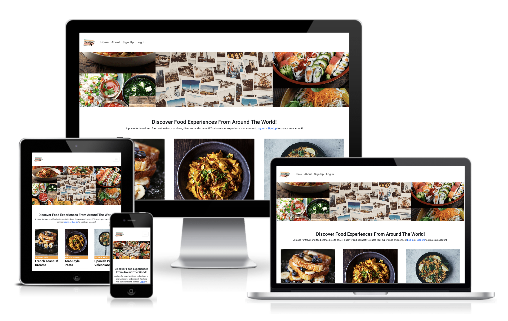

## Planning
When it came to planning the project I used agile methodologies to plan the project. I worked in three sprints to complete the project. I ordered issues on the level of importance, from essential features to features that were just nice to have. This was done so that the core functionality of the site was up and running and then the features that would have been nice to have could be done at a later stage if there was scope to do so. I used several tools to help me with the planning of the project. I created a Kanban for the project using GitHub projects, which helped me keep good track and have a clear vision of the different areas I was working on and the progress I was making. I spent a lot of time planning before I began working on my code which gave me a great foundation beforehand and helped me a lot when working on the project. I mapped out the information architecture and created wireframes to help me have a strong visualisation of the site. 

### User Stories
#### Site User
- As a Site User I can see a list of posts so that I can choose which one to view
- As a site user I can click on a post so that I can view the post details
- As a Site User I can view the number of likes on a post so that I can see which recipes are more popular
- As a Site User I can like or unlike a post so that I can interact with the content
- As a Site User I can view the comments on a post so that I can read the conversation
- As a Site User I can comment on posts so that I can be part of the conversation
- As a Site User I can create, read, update and delete posts so that I can manage the site's content
- As a Site User I can register an account so that I can have access to the site
- As a Site User I can log in/out so that I can interact with the site
- As a Site User I can view a paginated list of posts so that I can easily select a post to view

#### Site Admin
- As a Site Admin I can view the number of likes on a post so that I can see which recipes are more popular
- As a Site Admin I can view the comments on a post so that I can read the conversation
- As a Site Admin I can approve or disapprove comments so that I can filter out inappropriate comments
- As a Site Admin I can create, read, update and delete posts so that I can manage the site's content
- As a Site Admin I can tell users about the website so that I can inform users about the site and why they should return

#### Site Owner Goals
As the owner of this site, my goals are to:
- Create a site where people can create and post
- Create a site where people can see posts on different experiences
- Create a site where people can like and unlike posts
- Create a site where people can see the number of likes on a post
- Create a site where people can comment on posts
- Create a site where people can view comments on posts
- Create a site where people can register an account
- Create a site where people can log in and out 

### Kanban Board
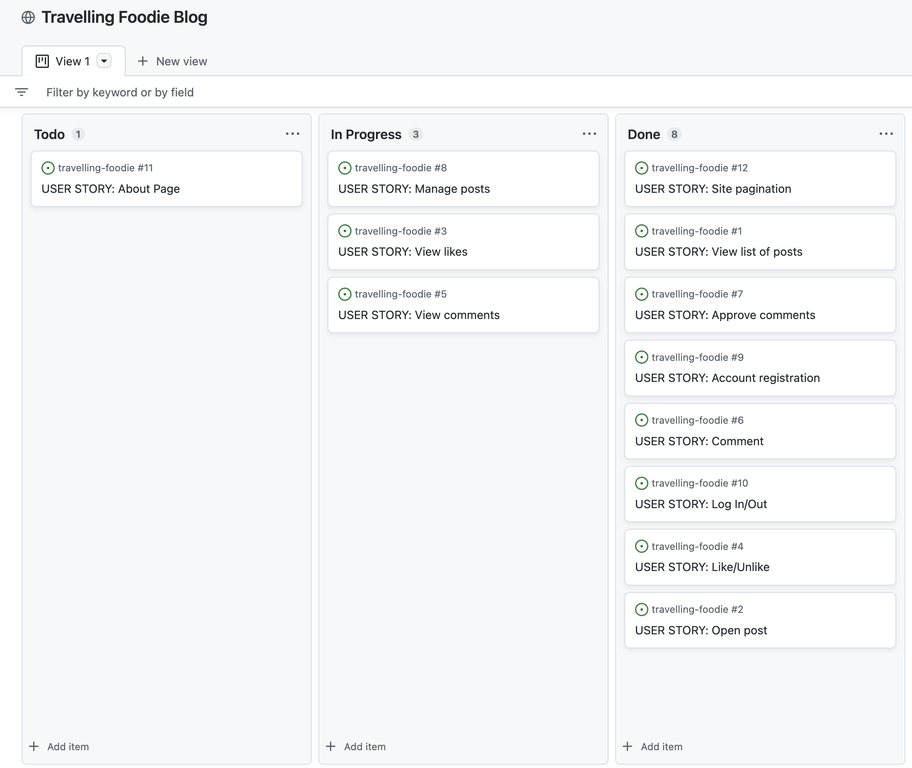

### Information Architecture
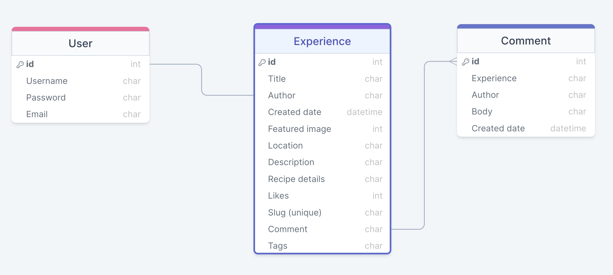

## UX Design

### Design Choices
#### Typography
1 main font was used for the entire site. The font used was Roboto, sans-serif and it was sourced from Google fonts. The reason I chose this font was because of its simplistic look and because it was easy to read.

#### Colour Palette
I chose to go for a very rich colourful palette. To complement the theme of the site, all about experiencing amazing food around the world. I chose to go for a combination of oranges, reds and teals. The colour palette I generated is available at https://coolors.co/f7a133-f47a33-f14738-dc3c35-369184-61bda9

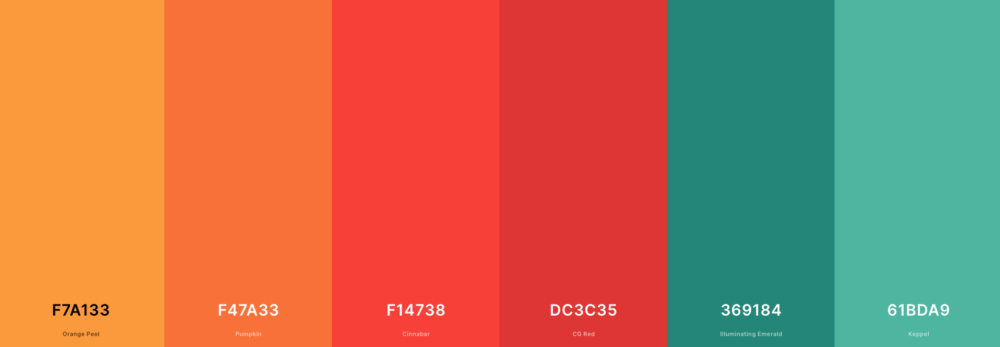

#### Logo
To showcase the theme of the site I designed a logo to show a stack of plates with a plane going around it.

### Wireframes
#### Home Page
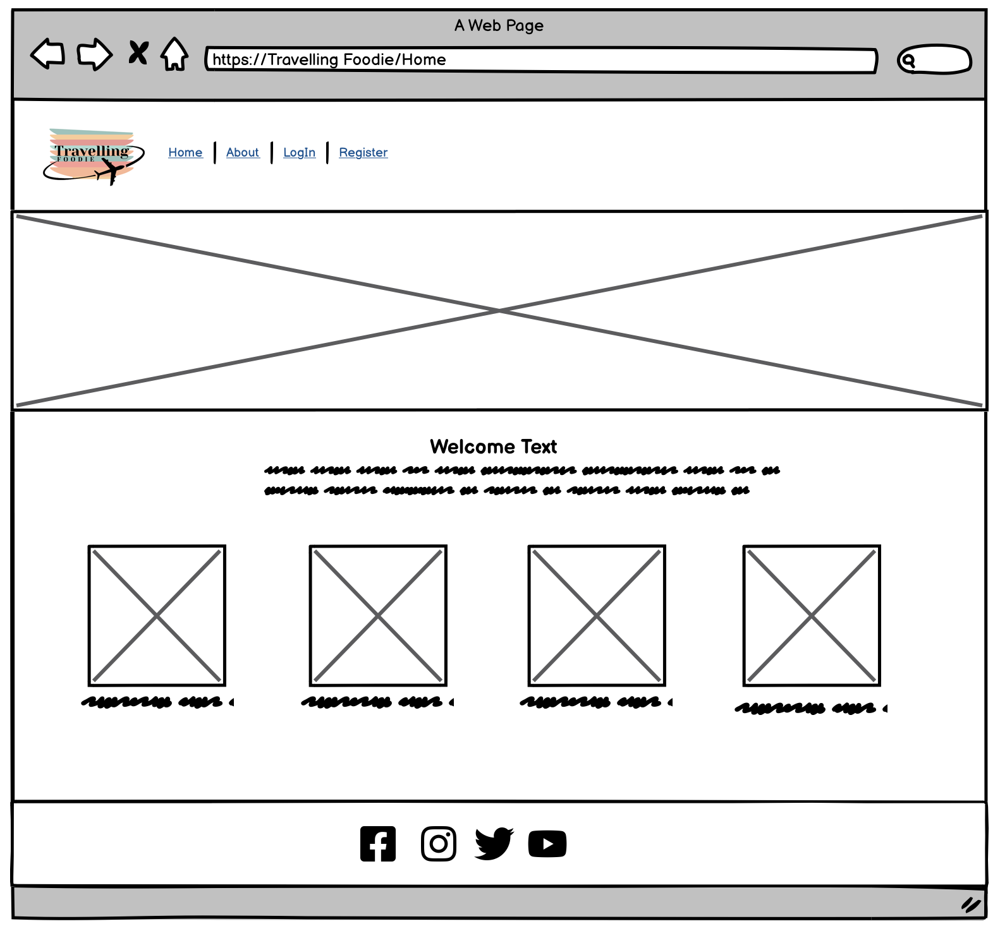

#### About Page
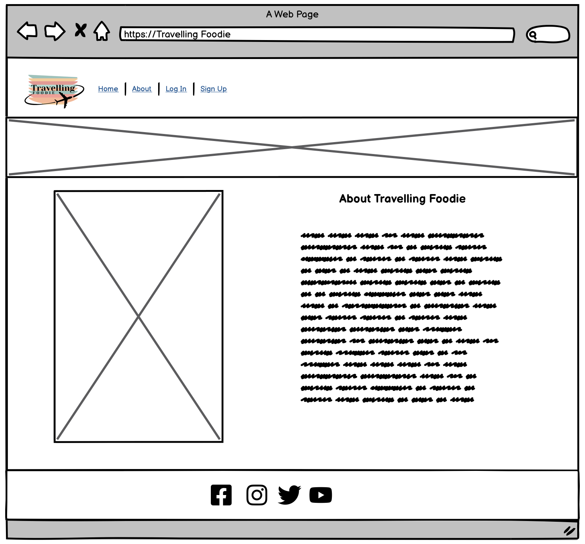

#### Experience Detail Page
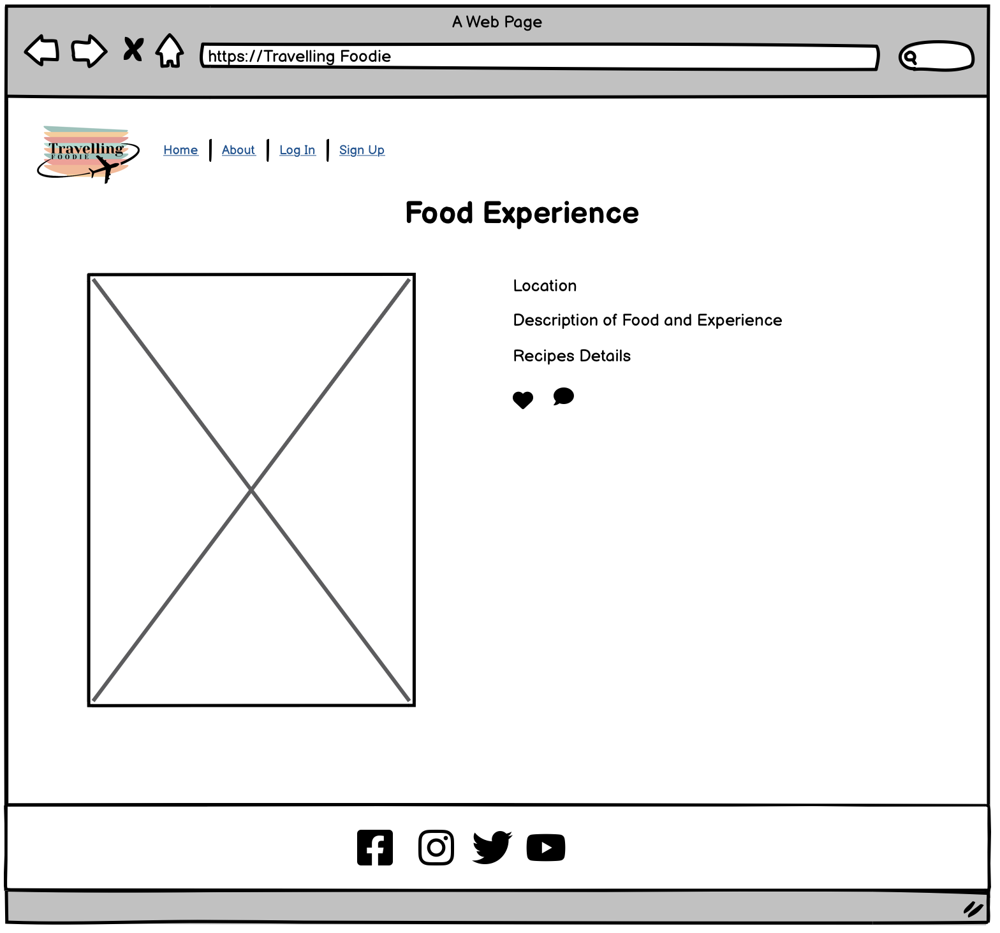

#### Add experience Page
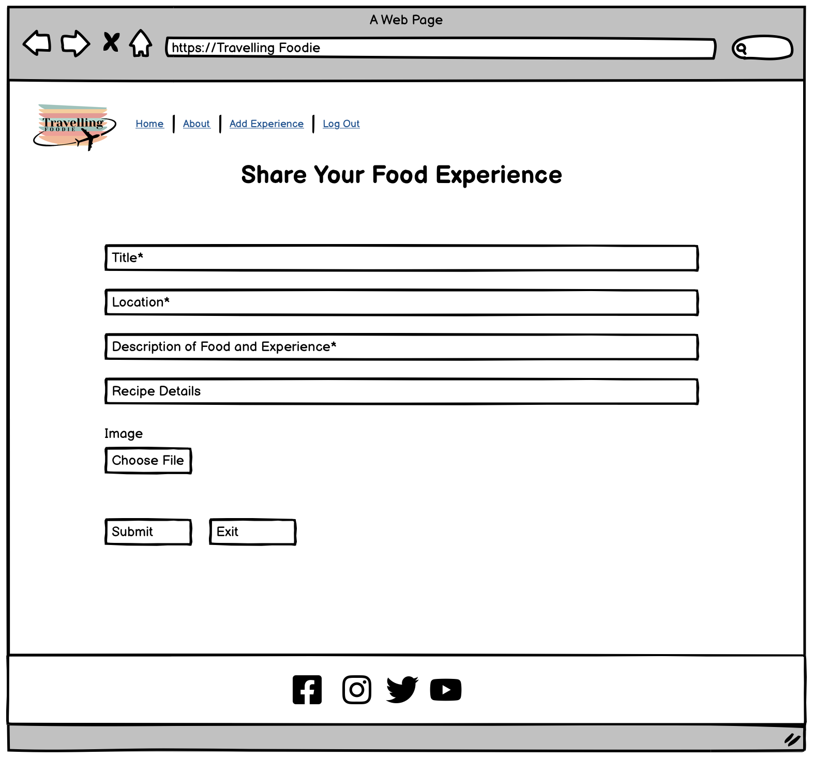

#### Sign Up Page
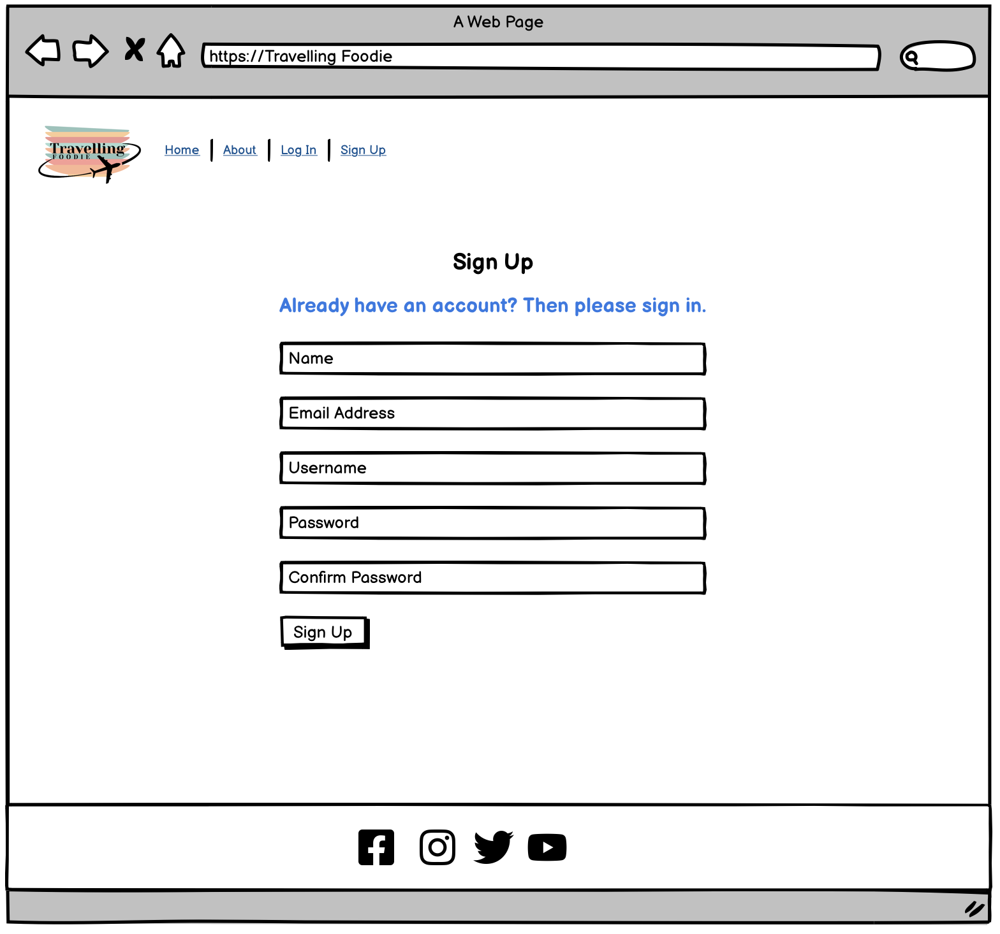

#### Log In Page
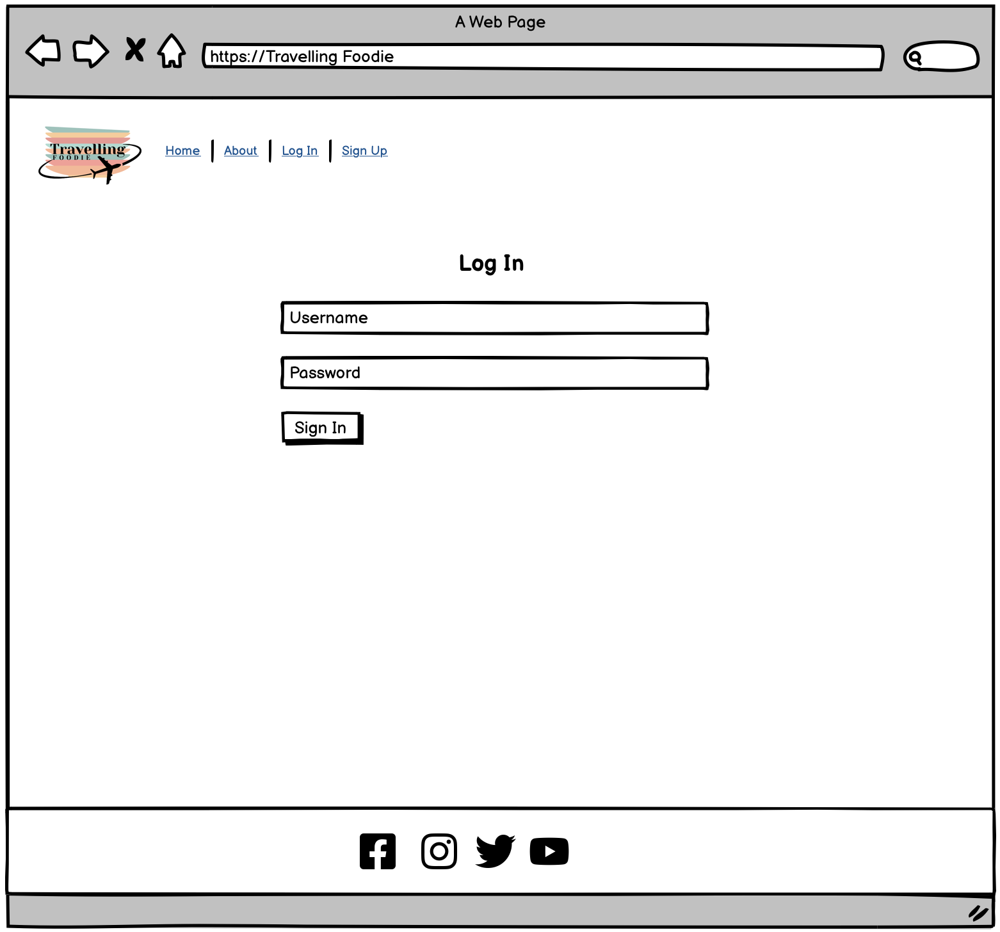

## Features
### Existing Features
#### Navigation
The navigation bar sits at the top of all the pages and has links to the different pages across the site. The page links change depending on if a user is logged in or out of the page. If a user is not yet logged in it will show page links to the home page, about page, sign-up page and log-in page. If a user is signed in, it whos the home page, about page, add experience page and log out page. The nav bar also collapses to a toggle on smaller screen sizes for better usability. 

#### Logo
The logo sits to the left of the navbar and showcases a stack of plates in different colours and a plane going around it. 

#### Home Page Header image
On the home page, her image is a collage of different types of food surrounding another collage of polaroid pictures of different countries. 

#### Home Page Content
The home page has a welcome section just underneath the hero image, giving a brief intro to the site and links to log in and register. Underneath the welcome message is the different experiences that have been uploaded by users. They are grouped in threes with an image of the food, the name of the author underneath, the title, the date it was added to the site and the number of likes on the post. The titles link to the experience details page, where the full content of the post can be seen. Below the content is a next button to go to the next page of experiences.

#### Footer
The footer links to different social media pages.

#### Experience Details
The experience details page has the image of the food, the title the author, the date and time it was added, the country of the post, the content, the recipe. The like button is under the content on the experience details page, where a user can see the number of likes on a post and like or unlike the post. The comment button is under the content on the experience details page, where a user can see the number of comments on a post.

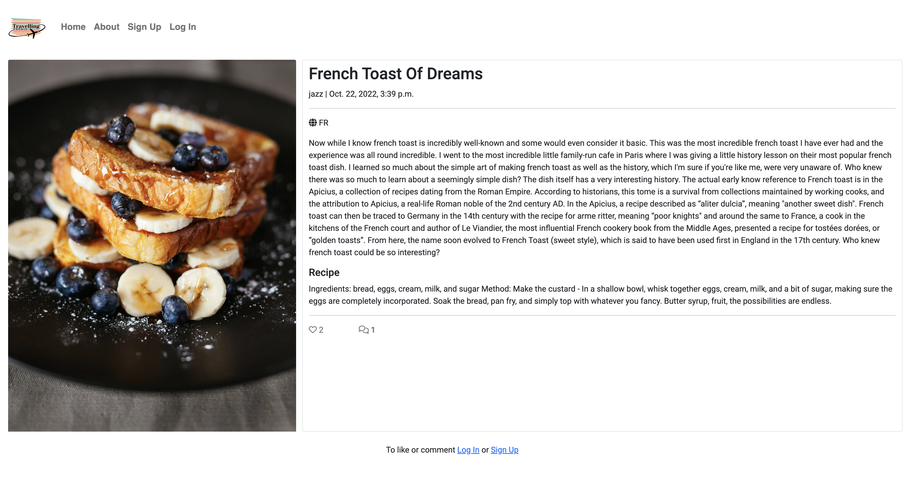

#### Edit/Delete Experience
If a user is logged in and in their post, they get the option below the content to edit or delete the post. When the click edit they can edit all the contents of the experience. When they click edit they are taken to a confirmation page. 

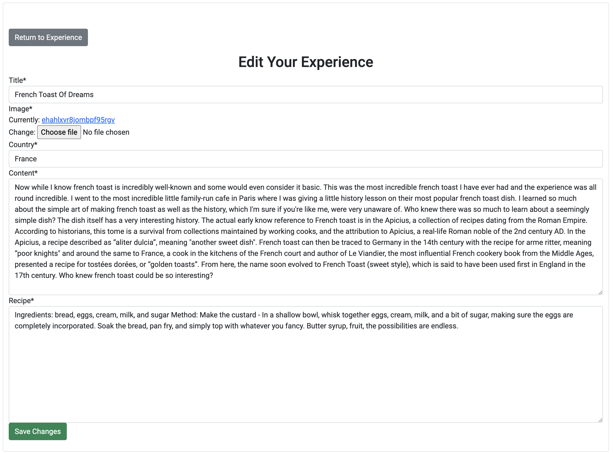

#### Comment Box
When I user is logged in a comment box appears at the bottom of the expereince details page where the user can comment on the post. When a user leaves a comment, they receive an alert saying their comment is awaiting approval.

#### Add experience Page
The add experience page is a form where the user can upload their experience to the site. They can add a title, upload an image, select a country, and add the content and recipe. 

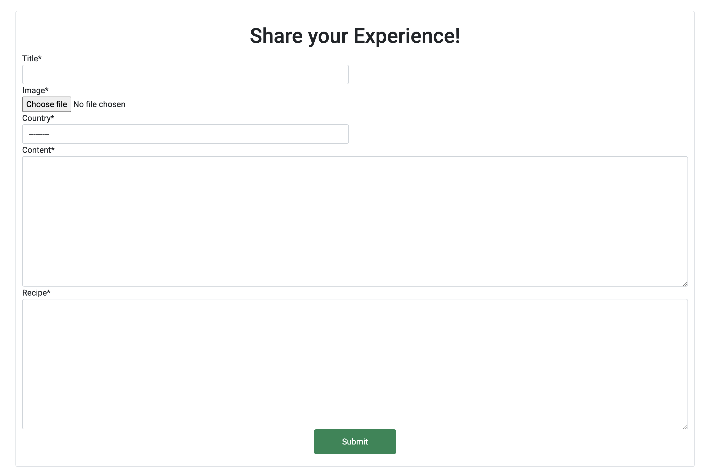

#### About Page
The about page has a hero image of a collage of polaroid pictures of different countries. Below the hero image is an image of people sitting around a dinner table with food and to the right of the image is some information about the site.

#### Sign Up Page
The sign-up page was formed using crispy forms. The user can simply input their username, optional email, and password twice to sign up.

#### Log In Page
The log-in page was formed using crispy forms. The user can simply input their username and password to log in. 

#### Log Out Page
When the user clicks on the log-out page they are directed to a confirmation page!

[Log out page](static/images/log-out.png)

## Testing
To ensure cross-compatibility, I tested the website across numerous devices and web browsers. The site was tested across different iPhones, a Samsung galaxy fold, an iPad, a Mac laptop, and a hp laptop. The site was also tested across Google Chrome, Safari and Edge. For responsiveness, I used the developer tool for screen adjustments, so I could see how the site would look on different screen sizes as I made the required adjustments for it to be completely responsive.

### Bugs
#### URL not linking
I had an issue linking up my URLs. Every time I tried to go to a page I would get an error message saying 'no experience matched the given query'. The issue was because the URL root that only used the argument '<slug:slug>/' was not at the end of the URLs. I fixed this by moving the URL to the bottom of the list which fixed the issue.  

#### Slug not generating
I had an issue with the slug not generating for an experience post when I created one through the site which resulted in an error when I tried to create a post. I was able to fix that by generating a slug automatically from the title when saving a post by adding a slug function to my models.py. This solved the issue.

#### Submit button in add experience not working
The submit button in my add experience stopped working after I fixed the slug issue. The reason for this was that I had the slug blank set to false but also had created a function in my models to autogenerate a slug. I was able to fix this by changing my slug blank to true so that the auto generate function would be able to go through.

### Manual Testing
#### Navigation Links
I tested the navigation links which worked as expected. The navigation bar was visible on every screen. It was responsive as it toggled as I viewed it on smaller screen sizes. The nav buttons brought me to the correct pages. They correctly changed to the expected options when I was logged in giving me the button to add an experience and log out. It also gave the expected options when I was not logged in giving me the options to sign up or log in.

#### Footer Links
I tested the footer links. When I clicked on a social media icon it took me to the social media page, opening up a new tab.

#### Home Page
I tested the home page. In the welcome section of the home page when I clicked on the login link it took me to the log-in page. When I clicked the link to sign up it took me to the sign-up page. 

#### View Experience post
I tested the view experience post. I was able to click on the title of an experience which brought me to the experience detail page. When I wasn't logged in it gave me the correct instructions below the content to sign up or log in to like or comment on the experience. When I was logged in it gave me the box at the bottom of the screen to add a comment and I was able to like the post. When I was underneath a post that I added it gave me additional buttons to edit or delete the post. 

#### Sign up
The sign-up page currently appeared in the nav bar when not logged in. I was able to sign up. The link in the nav bar worked, opening up the sign-up page where I was able to input my username, email(optional) and password and sign up.

#### Log In/log Out
The log-in and log-out appeared in the nav bar correctly. When I was not logged in, the log-out option was in the nav bar and when I was logged out the log-in option appeared in the nav bar. I was able to log in by adding my username and password. When I logged out I was taken to a confirmation page to log out of the site.

#### Like
I tested the like feature and was able to like posts when I was logged in. When I was logged out I was given instructions on the experience details page to log in or signup to like the experience. I was also able to like a post and unlike a post.

#### Comment
I tested the comment feature. The same with the like feature when I was logged in there was a box below the content for me to submit a comment. When I submitted a comment I got an alert saying "your comment is awaiting approval". When I approved the comment through admin, the comment appeared in the experience. When I was not logged in I could see instructions to log-in or sign-up to leave a comment. 

#### Add experience
I tested adding an experience. The option only appeared in the nav bar when I signed in. When I clicked on the option I was able to add a title, upload an image, select the country, add the content, recipe and submit. Once I submitted the experience it appeared on the home page.

#### Edit/Delete Experience
I tested the edit and delete experience feature. The edit and delete feature only appeared when I was logged in and in my own experience. When I clicked on edit I was able to edit the title, image, country, content and recipe and submit. When I clicked on delete I was taken to a confirmation page where it asked me to confirm if I wanted to delete the experience and gave me the option to cancel. When I clicked the delete button it deleted the experience. When I clicked the cancel button it took me back to the experience page. 

### Automated Testing
#### PEP8
- I used the PEP8 validator on my Gitpod Workspace. All pages were cleared. 

#### HTML
- Testing was carried out using Jigsaw - https://validator.w3.org/ 
- All pages passed.

#### CSS
- Testing was carried out using Jigsaw - https://jigsaw.w3.org/css-validator/
- No errors were found when passing through the official (Jigsaw) validator.

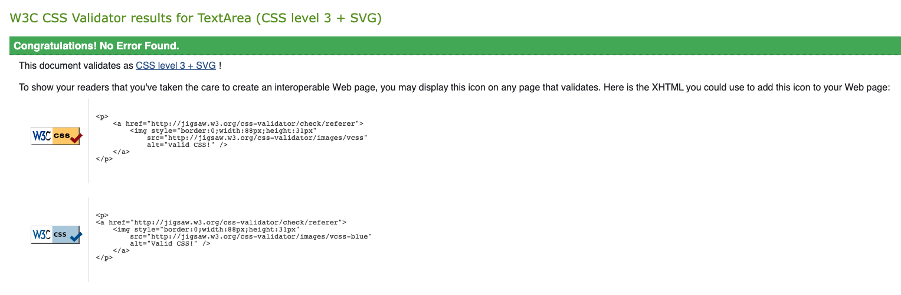

## Deployment
The live deployment can be found using the following URL - https://events-planner-p3.herokuapp.com/

I deployed this project in Heroku using the following steps:
1. Log In to Heroku
2. From the Heroku dashboard, click on "New" and in the drop-down click "Create new app"
3. Create a unique name for the project, select your region and click "Create app"
4. Navigate to the Resources tab, under add-ons search for Heroku Postgres and.
5. Navigate to the Settings tab
6. Scroll down to config var and click on "Reveal Config Vars"
   - Add Cloudinary url
   - Add Database url
   - Add Secret key
   - Click "Add"
7. Using the code institute template, you must add another config var
   - In the field for KEY enter PORT
   - In the field for VALUE enter 8000
8. Navigate to the Deploy tab at the top of the page
9. Go to deployment method and select "GitHub"
10. Confirm you want to connect to GitHub by clicking "Connect to GitHub"
    - Insert repository name and click "Search"
    - Click "Connect" to link up Heroku app to the GitHub repository code
11. Scroll down and choose a deployment method 
    - In manual deploy click "Deploy Branch"
    - Then click on "Enable Automatic Deploys" 
   - This allows Heroku to rebuild your app every time you push a new change to your code to GitHub

## Technologies Used
* Python
* HTML
* CSS
* Bootstrap 4
* Django
* Cloudinary
* Heroku

## Credits
- I used other people's projects for ideas and inspiration 
  - https://github.com/KarinOldbring/vegan-a-eat
  - https://github.com/dougiemath/photo_sharing_site  

### Media
- Pictures were taken from the open source site Unsplash -  https://unsplash.com/ 

## Support
* Richard Wells Code Institute Mentor.
