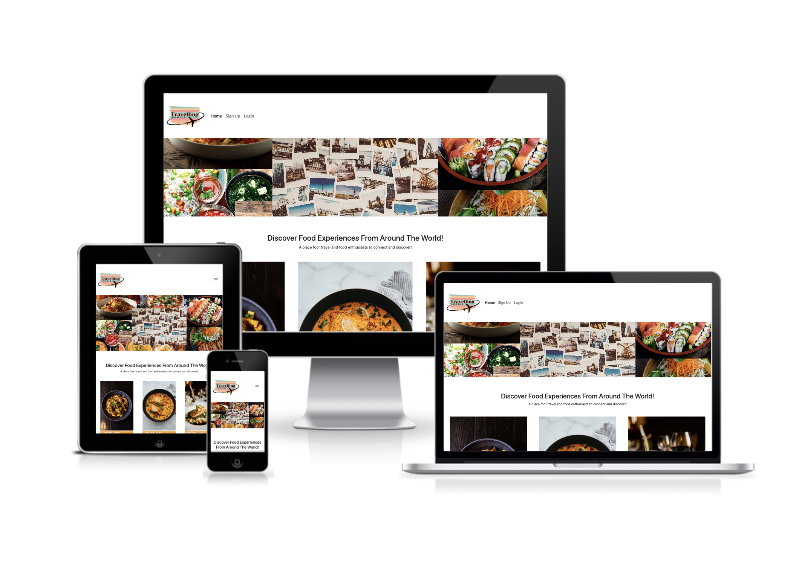

# Travelling Foodie
Travelling foodie is a hub for sharing food centered travellin experiences. Where people can share their recipes and advantures from around the world. Its for people who love experiencing and exploring different foods, learning different cultures and connecting with people through their shared passion. The aim and focus of the site is to share experiences, passions, history and knowledge. A way of learning about different cultures connecting with people. It is a community. 

## Planning
When it came to planning the project I used agile methodologies to plan the project. I worked in three sprints to complete the project. I ordered issues on level of importants, from features that were essential, to features that were just nice to have. This was done so that the core functionality of the site was up and running and then the features that would have been nice to have could be takled at a later stage if there was scope to do so. I used a number of tools to help me with the plannin of the project. I created a Kanban for the project using github projects, which helped me keep good track and have a clear visual of the different areas I was working and the progress I was making. I spent alot of time on planning before I began working on my code which gave me a great foundation beforehad and helped me alot when working on the project. I mapped out the information architecture and created wireframes to help me have a strong visualisation of the site. 

### User Stories
#### Site User
- As a Site User I can see a list of posts so that I can choose which one to view
- As a site user I can click on a post so that I can view the post details
- As a Site User I can view the number of likes on a post so that I can see which recipes are more popular
- As a Site User I can like or unlike a post so that I can interact with the content
- As a Site User I can view the comments on a post so that I can read the conversation
- As a Site User I can comment on posts so that I can be part of the conversation
- As a Site User I can create, read, update and delete posts so that I can manage the site's content
- As a Site User I can register an account so that I can have access to the site
- As a Site User I can log in/out so that I can interact with the site
- As a Site User I can view a paginated list of posts so that I can easily select a post to view

#### Site Admin
- As a Site Admin I can view the number of likes on a post so that I can see which recipes are more popular
- As a Site Admin I can view the comments on a post so that I can read the conversation
- As a Site Admin I can approve or disapprove comments so that I can filter out inappropriate comments
- As a Site Admin I can create, read, update and delete posts so that I can manage the site's content
- As a Site Admin I can tell users about the website so that I can inform users about the site and why they should return

#### Site Owner Goals
As the owner of this site, my goals are to:
- Create a site where people can create and posts
- Create a site where people can see posts on different experiences
- Create a site where people can like and unlike posts
- Create a site where people can see the number of likes on a post
- Create a site where people can comment on posts
- Create a site where people can view comments on posts
- Create a site where people can register an account
- Create a site where people can log in and out 

### Kanban Board

### Information Architecture

## UX Design

### Design Choices
#### Typography
1 main font was used for the entire site. The font used was Roboto, sans-serif and it was sourced from Google fonts. The reason I chose this font was because of its simplistic look and because it was easy to read.

#### Colour Palette
I chose to go for a very rich colourful palette. To complement the theme of site all about experiencing amazing food around the world. I chose to go for a cobination of oranges, reds and teals. The colour palette I generated is available at https://coolors.co/f7a133-f47a33-f14738-dc3c35-369184-61bda9

#### Logo
In order to showcase the theme of the site I designed a logo to showed a stack of plates with a plane going around it.

### Wireframes
#### Desktop
#### Mobile

## Features
### Existing Features
#### Navigation
The navigation bar sits at the top of all the pages and has links to the different pages across the site. The page links change depending on if a user is logged in or out of the page. If a user is not yet logged in it will show page links to the home page, about page, sign up page and log in page. If a user is signed in, it whos the home page, about page, add experience page and log out page. The nav bar also collapses to a toggle on smaller screen sizes for better usability. 

#### Logo
The logo sites to the left of the navbar and showcases a stack of plates in different colours and a plane going around it. 

#### Home Page Hero image
The home page her image is a collage of different types of food surrounding another collage of polaroid pictures of different countries. 

#### Home Page Content
The home page has a welcome section just underneat the hero image, giving a brief into to the site and links to login and register. Underneath the welcome message are the different experiences that have been uploaded by users. Thy are grouped in three's with an image of the food, the name of the author underneath, the title, the date it was added to the site and the number of likes on the post. The titles link the to experince details page, where the full content of the post can be seen. Below the content is a next button to go the the next page of experiences.

#### Footer
The footer links to different social media pages.

#### Experience Details
The experience details page has the image of the food, the title the author, the date and time it was added, the country of the post, the content, the recipe, a like and comment button showing how many likes and comments on the post and a comments section at the bottom. When a user is not yet signed in there is instructions below the content for a user to log in or sign up in order to like the post or leave a comment. If a user is logged in and in their own post they get the option below the content to edit or delete the post. When a user leaves a comment, they receive an alert saying their comment is awaiting approval.

#### About Page
The about page has a hero image of a collage of polaroid pictures of diferent countries. Below the hero image is an image of people sitting around a dinner table with food and to the right of the image is an blurb about the site.

#### Log In Page
The sign up page was formed using crispy forms. The user can simply input their username, email which is optional, and password twice to sign up.

#### Sign Up Page
The log in page was formed using crispy forms. The user can simply input their username and password to log in. 

#### Log Out Page
When the user clicks on the log out page they are directed to a confirmation page!
[Log out page](static/images/)

#### Experience Details Page

#### Add experience Page

#### Like

#### Comment

### Future Features

## Testing

### Manual Testing
#### Easy to navigate and clear instructions
#### View Experiences
#### Register
#### Login
#### Like
#### Comment
#### Add experience
#### Edit experience
#### Delete experience

### Automated Testing

#### PEP8
I passed the code through [PEP8](http://pep8online.com/) and the result showed all right with no issues.

#### HTML

#### CSS

#### Javascript

#### Lighthouse

### Bugs
#### Adding django ratings field 
Following the steps to add the ratings field. The last step was python manage.py syncdb but the terminal gave an error of SyntaxError: invalid syntax
#### Summernote error
clean() got an unexpected keyword argument 'styles'

I fixed this iss with summernote by removing the summernote import from the top of the models.py file and changing....

## Deployment
The live deployment can be found using the following URL - https://events-planner-p3.herokuapp.com/

I deployed this project in Heroku using the following steps:
1. Log In to Heroku
2. From the Heroku dashboard, click on "New" and in the drop-down click "Create new app"
3. Create a unique name for the project, select your region and click "Create app"
4. Navigate to the Settings tab
5. Scroll down to config var and click on "Reveal Config Vars"
   - In the field for KEY enter CREDS 
   - In the field for VALUE paste in all the content from the creds.json file. 
   - Click "Add"
6. Using the code institute template, you must add another config var
   - In the field for KEY enter PORT
   - In the field for VALUE enter 8000
7. Scroll down to buildpacks and click on "Add buildpack"
   - Select python and click "Save changes"
   - Select nodejs and click "Save changes"
   - Make sure python is on top and nodejs underneath
8. Navigate to the Deploy tab at the top of the page
9. Go to deployment method and select "GitHub"
10. Confirm you want to connect to GitHub by clicking "Connect to GitHub"
    - Insert repository name and click "Search"
    - Click "Connect" to link up Heroku app to the GitHub repository code
11. Scroll down and choose a deployment method 
    - In manual deploy click "Deply Branch"
    - Then click on "Enable Automatic Deploys" 
      - This allows Heroku to rebuild your app every time you push a new change to your code to GitHub

## Technologies Used
* Python
* Javascript
* HTML
* CSS
* Bootstrap 4
* Django
* Cloudiary
* Heroku

## Credits

## Support
* Richard Wells Code Institute Mentor.